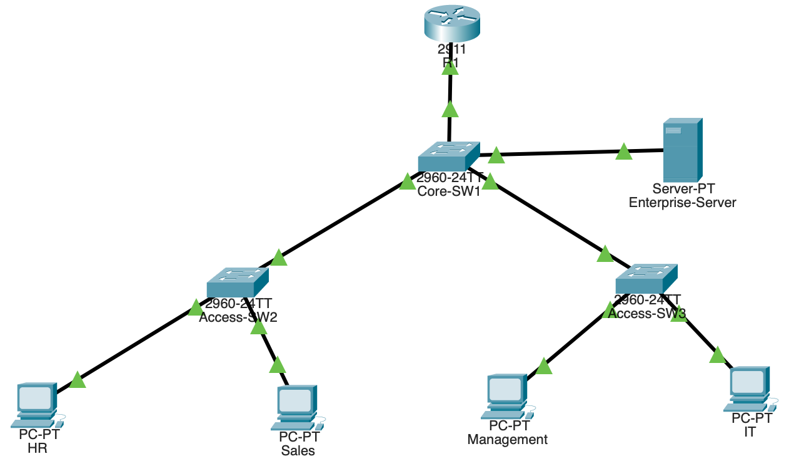

# Enterprise Network Design

## Project Overview

This project demonstrates the design and implementation of a simulated enterprise network using Cisco Packet Tracer. The network is designed to reflect a real-world organizational structure with multiple departments, VLAN segmentation, inter-VLAN communication using Router-on-a-Stick architecture, centralized DHCP services, and ACL-based security policies.

The main objective of this project is to apply enterprise networking concepts including switching, routing, IP management, and network security in a realistic environment.

## Network Topology

The network follows a hierarchical design model consisting of:

- Core Layer (Core Switch)
- Distribution Layer (Router)
- Access Layer (Switches)
- End Devices Layer

### Devices Used

- 1 × Cisco 2911 Router (R1)
- 1 × Cisco 2960 Core Switch (Core-SW1)
- 2 × Cisco 2960 Access Switches (Access-SW2, Access-SW3)
- Multiple End Devices (PCs)
- 1 × Enterprise Server (DHCP Server)

## Network Diagram

## VLAN Design

The network is segmented into multiple VLANs to isolate departments and improve security and performance.

| VLAN ID | Department   | Network Address     |
|----------|--------------|---------------------|
| 10       | Management   | 192.168.10.0/24     |
| 20       | HR           | 192.168.20.0/24     |
| 30       | IT           | 192.168.30.0/24     |
| 40       | Sales        | 192.168.40.0/24     |
| 50       | Server       | 192.168.50.0/24     |

Each VLAN represents a separate broadcast domain.

## Inter-VLAN Routing

Inter-VLAN communication is implemented using Router-on-a-Stick configuration on R1.

### Router Subinterfaces

- G0/0.10 → VLAN 10 → 192.168.10.1  
- G0/0.20 → VLAN 20 → 192.168.20.1  
- G0/0.30 → VLAN 30 → 192.168.30.1  
- G0/0.40 → VLAN 40 → 192.168.40.1  
- G0/0.50 → VLAN 50 → 192.168.50.1  

Each subinterface uses IEEE 802.1Q encapsulation.

## DHCP Implementation

A centralized DHCP server is used to automatically assign IP addresses to all end devices.

Each VLAN has a dedicated DHCP pool containing:

- Default Gateway
- Subnet Mask
- IP Address Range
- DNS Server

This eliminates manual IP configuration and simulates real enterprise environments.

## DHCP Relay Configuration

Since the DHCP server is located in VLAN 50, router-based DHCP relay is required.

The `ip helper-address` command is configured on all VLAN subinterfaces to forward DHCP requests to the DHCP server.

This enables centralized IP management across all VLANs.

## Switching Configuration

- VLANs 10, 20, 30, 40, 50 are configured on all switches
- Trunk links use IEEE 802.1Q encapsulation
- Access ports are assigned to respective VLANs per department

## ACL Security Implementation

Access Control Lists (ACLs) are implemented on Router R1 to control inter-VLAN traffic.

### Security Policies

- HR is restricted from accessing IT network
- Sales is restricted to Server access only
- Management has full access to all VLANs

### ACL Behavior

Traffic is filtered based on source and destination IP addresses to enforce network security policies.

## Testing & Verification

The network was tested using the following methods:

- Successful DHCP IP assignment for all devices
- Inter-VLAN communication using ICMP (ping)
- ACL enforcement verified by blocked and allowed traffic tests
- Router subinterface and trunk verification

All tests confirmed proper network operation.

## Network Traffic Flow

End Device → Access Switch → Core Switch → Router → DHCP Server / Other VLANs

This represents a real enterprise network architecture with centralized routing and controlled access.

## Tools & Technologies Used

- Cisco Packet Tracer
- Cisco 2911 Router
- Cisco 2960 Switches
- VLAN Configuration
- Trunking (IEEE 802.1Q)
- Router-on-a-Stick Inter-VLAN Routing
- DHCP Server Configuration
- DHCP Relay (ip helper-address)
- Access Control Lists (ACL)

## Learning Outcomes

Through this project, the following skills were developed:

- Enterprise network design and segmentation
- VLAN configuration and management
- Inter-VLAN routing implementation
- DHCP server setup and automation
- DHCP relay configuration
- Network security using ACLs
- Network troubleshooting and verification

## Final Summary

This project demonstrates a complete enterprise network implementation using Cisco Packet Tracer.

It integrates VLAN segmentation, inter-VLAN routing, DHCP services, and ACL-based security policies into a unified network design that simulates real-world enterprise environments.

The project reflects practical networking skills suitable for junior network engineering roles.

## Future Improvements

- Implement STP optimization for redundancy
- Add network monitoring using SNMP/Syslog
- Simulate firewall-based segmentation
- Introduce dynamic routing protocols (OSPF/EIGRP)